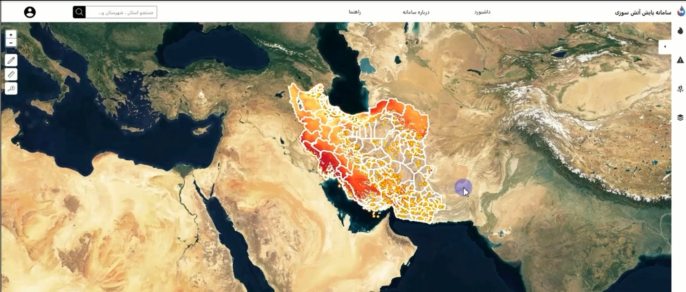

# Fire_WebGIS
This application displays wildfire points based on applied filters, including:

-Fire start and end dates

-Time of observation (day or night)

-Sensor type

-Province

-County

-Confidence level

See the Video --> https://github.com/ElahehKarampour/Fire_WebGIS/releases/download/v1.0.0/fire.mp4

